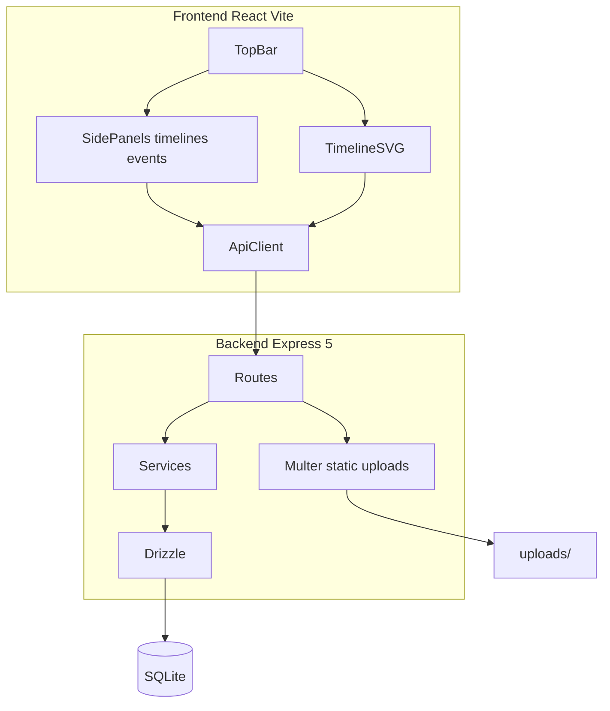
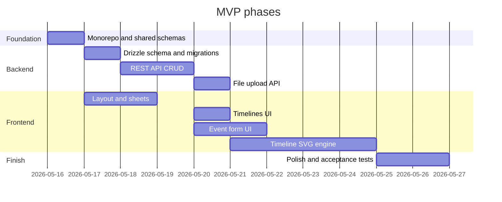

# Build plan: «История в таймлайне» MVP

## Current state

[`Timeline_01`](.) contains only [`LICENSE`](LICENSE). All application code, tooling, and docs must be created from scratch.

## Your decisions (from spec §9)

| Topic | Choice |
|-------|--------|
| Attachments | **Upload to server** + `StorageLink` (plus optional `OriginalLink`) |
| BCE dates | **Not in MVP**; use extensible date types/API so BCE can be added later |

## Target architecture



## Recommended repo layout

Monorepo (single root `package.json` with workspaces):

```
Timeline_01/
├── package.json              # workspaces: apps/*
├── apps/
│   ├── web/                  # React + Vite + TS + Tailwind + shadcn
│   └── api/                  # Express 5 + TS + Drizzle + Zod
├── packages/
│   └── shared/               # Zod schemas, DTO types, date helpers
├── drizzle/                  # migrations (or apps/api/drizzle)
├── uploads/                  # gitignored; served as /uploads/*
├── data/
│   └── timeline.db           # gitignored SQLite file
└── README.md
```

**Build tooling:** Vite for the client; `tsx` + `esbuild` (or `tsup`) for API bundle in production. Root scripts: `dev` (concurrent web + api), `build`, `db:migrate`, `db:seed` (optional demo data).

---

## Phase 0 — Foundation (day 1)

1. **Scaffold monorepo**
   - Root `package.json` workspaces, TypeScript project references, ESLint/Prettier (match team preference).
   - `apps/web`: `npm create vite@latest` → React + TS; add Tailwind; init [shadcn/ui](https://ui.shadcn.com/) (Button, Sheet, Dialog, Checkbox, Input, Textarea, Select, Badge, AlertDialog).
   - `apps/api`: Express 5, `cors`, `helmet`, JSON body parser, error middleware.

2. **`packages/shared`**
   - Zod schemas mirroring spec §3 (timelines, events, links, tags, documents).
   - Shared validation rules: timeline name ≥3 chars; event `endDate >= startDate`; max 10 documents per event.
   - **Date helper module** (`packages/shared/src/dates.ts`):
     - MVP: ISO `YYYY-MM-DD` strings, `Date` only for display math where year ≥ 1.
     - Export `HistoricalDate` interface + parser placeholder for future BCE (e.g. signed year + era enum) so API/UI do not hard-code `new Date(year)` everywhere.

3. **Dev experience**
   - Vite proxy: `/api` → `http://localhost:3001`.
   - Env: `DATABASE_URL`, `UPLOAD_DIR`, `PORT`.
   - `.gitignore`: `node_modules`, `dist`, `data/`, `uploads/`, `*.db`.

---

## Phase 1 — Database and ORM (day 1–2)

Implement Drizzle schema per spec §3 in [`apps/api/src/db/schema.ts`](apps/api/src/db/schema.ts):

| Table | Notes |
|-------|--------|
| `TimelineTable` | `sortIndex` default on create (max+1) |
| `EventTable` | `endDate` nullable → app sets = `startDate` on save |
| `EventTimelineLink` | unique `(eventId, timelineId)` |
| `TagTable` | `color` as integer (store `0xRRGGBB`) |
| `TagEventLink` | unique `(eventId, tagId)` |
| `DocumentTable` | `resourceType` enum-like string |
| `DocumentEventLink` | unique `(eventId, documentId)` |
| `UserPreferences` | MVP: `timelineId` + **`visible: boolean`** (spec requires checkbox visibility; extend table now to avoid rework) |

**Cascade deletes** (spec §2.1, §2.2):
- Delete timeline → `EventTimelineLink`, `UserPreferences` for that timeline.
- Delete event → `EventTimelineLink`, `TagEventLink`, `DocumentEventLink` (documents orphaned unless you add cleanup job; MVP: delete unused documents on event delete).

Run migrations with `drizzle-kit generate` + `migrate`.

---

## Phase 2 — REST API (day 2–4)

Implement routes from spec §4.2 with Zod validation on body/query; uniform JSON errors; target &lt;300 ms on local SQLite.

### Timelines — `/api/timelines`

| Method | Behavior |
|--------|----------|
| GET | All timelines ordered by `sortIndex`, include `visible` from `UserPreferences` (default visible=true if no row) |
| POST | Create; validate name 3–60 chars; assign `sortIndex` |
| PUT `/:id` | Update name/description; optional reorder `sortIndex` |
| DELETE `/:id` | Cascade per spec; confirm handled on client only |

Add endpoints for MVP UX not in table but required by spec:
- `PATCH /api/timelines/:id/visibility` — toggle checkbox.
- `POST /api/timelines/reorder` — body `{ orderedIds: number[] }` for Up/Down buttons.

### Events — `/api/events`

| Method | Behavior |
|--------|----------|
| GET | Query `?timelineId=`; return events with nested `timelines[]`, `tags[]`, `documents[]` (single round-trip for timeline render) |
| POST/PUT | Transaction: upsert event, replace `EventTimelineLink`, `TagEventLink`, `DocumentEventLink` sets |
| DELETE | Cascade links; delete orphaned documents + files on disk |

### Tags — `/api/tags`

- GET all (search query `?q=`).
- GET `/recent` — last 6 distinct tags by latest `TagEventLink.createdDateTime`.
- POST — create with `name` + `color`.

### Documents — `/api/documents`

- POST multipart: `multer` → save under `uploads/{uuid}.{ext}`; set `StorageLink`, detect `resourceType` from mime.
- POST JSON variant for external URL → `OriginalLink` only.
- GET `?eventId=` — list for event form.
- DELETE `/:id` — remove DB row + file if `StorageLink` is local.

Serve static files: `app.use('/uploads', express.static(UPLOAD_DIR))`.

---

## Phase 3 — Frontend shell and layout (day 4–5)

Russian UI strings; min width 1024px (`min-w-[1024px]` on root).

```text
┌──────────────────────────────────────────────┐
│  TopBar (~10vh): [Временные шкалы] [Добавить] │
├──────────────────────────────────────────────┤
│  TimelineCanvas (~90vh)                      │
└──────────────────────────────────────────────┘
```

**Components** ([`apps/web/src`](apps/web/src)):

| Component | Responsibility |
|-----------|----------------|
| `AppLayout` | 10/90 split, white timeline area, border |
| `TopBar` | Two buttons; toggles side sheets |
| `TimelinesSheet` | Slide-in left panel (hidden by default) |
| `EventSheet` | Slide-in right panel (create/edit) |
| `ConfirmDialog` | shadcn AlertDialog for deletes |

**State:** React Query (`@tanstack/react-query`) for server state; local UI state for open panels, draft dirty flag.

**API client:** `fetch` wrapper in `apps/web/src/api/client.ts` typed from `packages/shared`.

---

## Phase 4 — Timeline management UI (day 5–6)

[`TimelinesSheet`](apps/web/src/features/timelines/TimelinesSheet.tsx):

- List with checkbox (visibility), hover actions: Up / Down / Delete (trash).
- Footer: «+ Добавить шкалу» → popover/modal form (name required ≥3, description ≤255); Save disabled until valid.
- Delete → modal «Удалить временную шкалу?»

Wire to API; invalidate `['timelines']` and `['events']` on mutations.

---

## Phase 5 — Event form UI (day 6–8)

[`EventSheet`](apps/web/src/features/events/EventSheet.tsx) — same panel for create (TopBar) and edit (click event):

| Field | Implementation |
|-------|----------------|
| Name, dates, notes | Controlled inputs; display `ДД.ММ.ГГГГ`, store ISO on submit |
| Tags | Combobox: recent 6, search, create-with-color picker → POST tag |
| Timelines | Multi-select, min 1 |
| Documents | `DocumentTable`: preview, description, delete; add URL or file upload (max 10) |

Behaviors (spec §5.3):
- Inline validation on blur.
- Autofocus first field on open.
- `beforeunload` + close guard: «Несохранённые изменения».

Delete event button + confirm dialog.

---

## Phase 6 — Timeline renderer (day 8–12) — highest risk

Custom **SVG** component [`TimelineCanvas`](apps/web/src/features/timeline/TimelineCanvas.tsx) (Canvas optional; SVG fits labels + connector lines well).

### 6.1 Time scale engine

[`timeScale.ts`](apps/web/src/features/timeline/timeScale.ts):

- Input: `viewStart`, `viewEnd` (Date or serial day numbers), `width`, `zoom`.
- Output: pixel `x(date)`, tick marks with **adaptive granularity** (millennia → centuries → decades → years → months).
- Initial range (spec §2.3):

| Condition | Range |
|-----------|--------|
| No events | today ± 100 years |
| One event | event ± 100 years |
| 2+ events | min(start) … max(end) |

### 6.2 Lanes (timelines)

- Filter to `visible === true`, sort by `sortIndex`.
- 1 lane: vertically centered; N lanes: equal vertical bands.

**Hover:** pale blue band background + increased lane height (CSS/SVG transition).

### 6.3 Events drawing

Per visible timeline, map linked events:

- Point: `startDate === endDate` → circle/marker on axis.
- Range: horizontal bar from `x(start)` to `x(end)`.
- Click → open `EventSheet` with event id.

### 6.4 Label collision avoidance (spec §2.3)

[`labelLayout.ts`](apps/web/src/features/timeline/labelLayout.ts):

1. Compute label bounding boxes above markers (rough width from text length).
2. Sweep events by x; if boxes overlap, assign increasing **label row** (stacked heights).
3. Draw thin connector lines from label to event anchor; on hover: thicker line + **bold** label + 100×100 preview of first image document.

Algorithm: greedy / interval partitioning is enough for MVP; no clustering (per your scope).

### 6.5 Pan and zoom

- Pan: drag on background + wheel scroll (horizontal).
- Zoom: Shift+wheel; trackpad pinch via `wheel` `ctrlKey`.
- Update `viewStart`/`viewEnd` with clamp so zoom has sensible min range (e.g. ≥ 1 month visible).

Use `requestAnimationFrame` for smooth transforms; avoid re-fetching on pan/zoom.

---

## Phase 7 — Polish and non-functional (day 12–14)

| Requirement | Approach |
|-------------|----------|
| Slide animations | shadcn `Sheet` + Tailwind `transition-transform` |
| LCP ≤ 2s | code-split `EventSheet`; lazy-load timeline; small initial payload |
| API ≤ 300ms | indexed FK columns; single GET events with joins |
| Browsers | test Chrome/Firefox/Safari per spec |
| `UserPreferences` | store visibility; optional: persist last zoom in JSON column later (spec §9.6) |

---

## Phase 8 — Verification against acceptance criteria (spec §8)

Manual test checklist mapped to features:

- [ ] CRUD timelines + reorder + visibility
- [ ] Create event on timeline; range vs point rendering
- [ ] Tags on-the-fly + recent 6
- [ ] Image attachment upload → thumbnail on hover
- [ ] Multi-lane vertical layout + lane hover
- [ ] Pan/zoom + adaptive ticks
- [ ] Initial date range rules
- [ ] Delete timeline cascades links + preferences

Optional: Playwright smoke tests for CRUD + one timeline screenshot.

---

## Suggested implementation order (summary)



---

## Out of MVP (spec §2.5) — do not build yet

- Search, import/export, auth/multi-user.
- Mobile layout (&lt;1024px).
- Event clustering (separate from label stacking).
- Per-timeline colors (unless you add later; spec §9.4 — default: **tag colors only**).

---

## Key technical risks

1. **Label layout + connectors** — budget most timeline time here; start with a fixed test dataset of overlapping events.
2. **Date extensibility** — centralize all conversions in `packages/shared`; never scatter `new Date('YYYY-MM-DD')` in SVG math without UTC/noon strategy.
3. **Upload security** — whitelist mime/extensions, size cap, sanitize filenames, no path traversal.
4. **`UserPreferences` schema** — add `visible` boolean now; spec delete behavior requires it.

---

## First commands after plan approval (Agent mode)

```bash
cd /home/evgeniy/VSProjects/Timeline_01
npm init -y
# scaffold workspaces, vite app, express app, drizzle, shared package
npm run dev   # web :5173 + api :3001
```

No commits unless you ask; README can be added in Phase 0.
