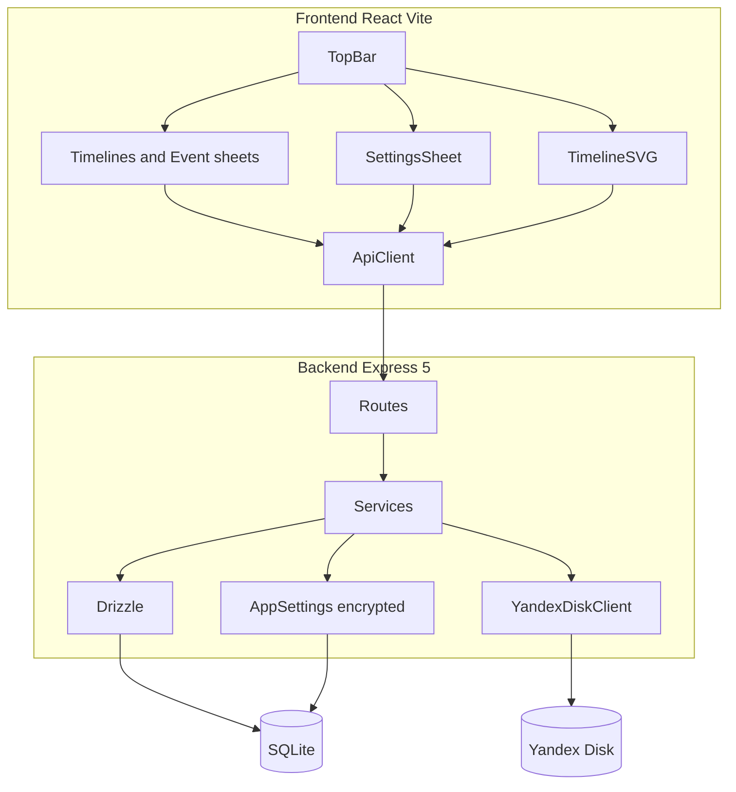
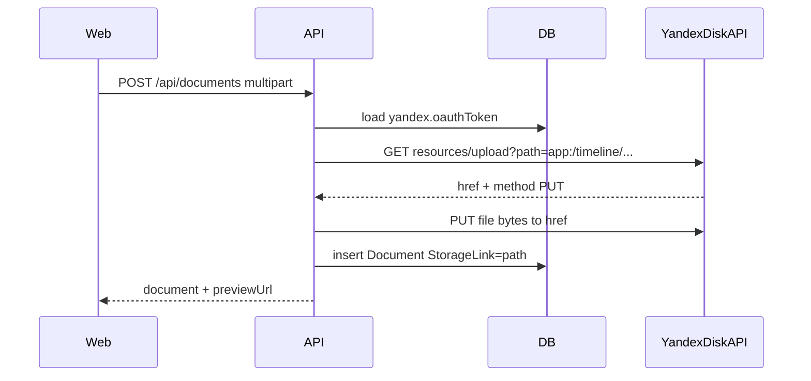
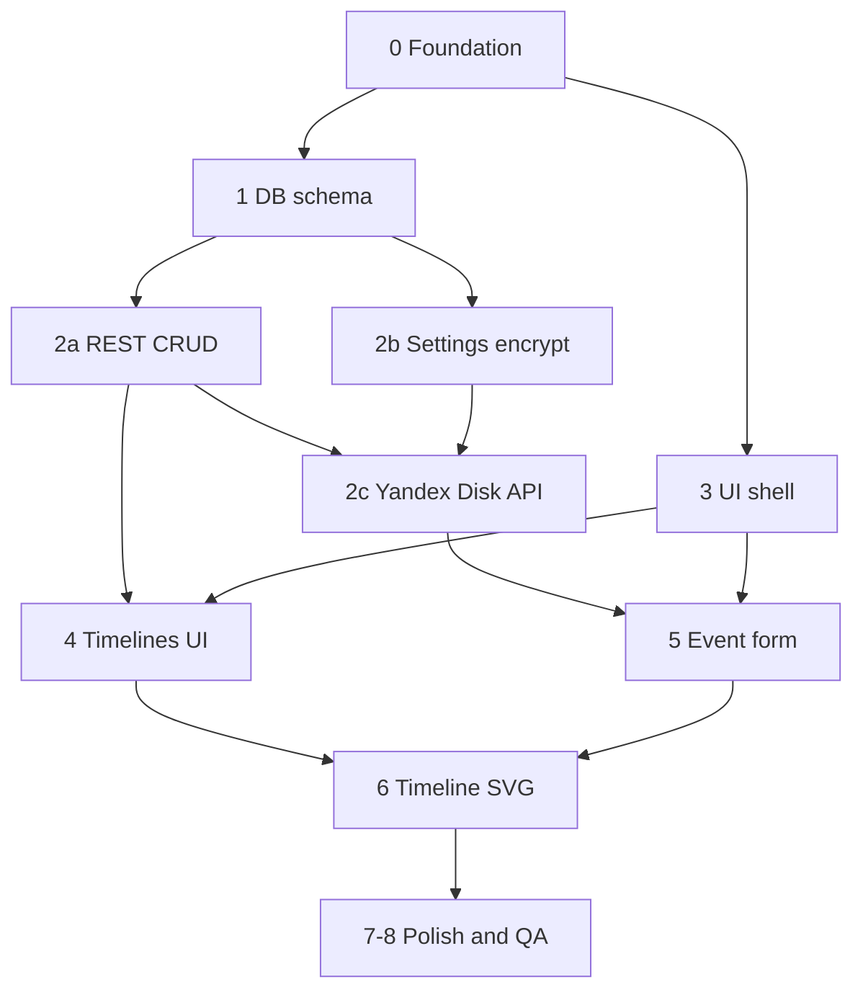

# Build plan: «История в таймлайне» MVP

**Last refreshed:** 2026-05-16

## Phase overview

| Phase | Focus | Depends on |
|-------|--------|------------|
| 0 | Monorepo, shared package, dev tooling | — |
| 1 | Drizzle schema (8 spec tables + `AppSettings`) | 0 |
| 2a | REST API: timelines, events, tags | 1 |
| 2b | App settings (encrypted) + `/api/settings` | 1 |
| 2c | Yandex Disk client + documents API | 2a, 2b |
| 3 | Frontend shell, TopBar, Settings/Timelines/Event sheets | 0 |
| 4 | Timelines management UI | 2a, 3 |
| 5 | Event form UI (incl. uploads) | 2c, 3 |
| 6 | SVG timeline renderer | 4 |
| 7–8 | Polish, acceptance testing | 5, 6 |

## Current state

[`Timeline_01`](.) contains only [`LICENSE`](LICENSE). All application code, tooling, and docs must be created from scratch.

## Your decisions (from spec §9)

| Topic | Choice |
|-------|--------|
| Attachments | **Yandex Disk** — files stored on Disk; `StorageLink` = Disk path; optional `OriginalLink` for external URLs |
| BCE dates | **Not in MVP**; use extensible date types/API so BCE can be added later |
| File storage backend | **[Yandex Disk REST API](https://yandex.com/dev/disk-api/doc/en/)** (`cloud-api.yandex.net/v1/disk/`), OAuth token configured in app settings |

## Date format convention

| Context | Format | Example |
|---------|--------|---------|
| UI display and form input | **`ДД.ММ.ГГГГ`** | `16.05.2026` |
| API and database storage | **`YYYY-MM-DD`** (ISO 8601) | `2026-05-16` |

All user-facing date fields (event start/end, timeline axis tick labels where applicable) use **`ДД.ММ.ГГГГ`**. Conversion happens only in `packages/shared` (`formatDisplay`, `parseDisplay`, `toStorage`); components must not format dates ad hoc.

---

## Target architecture



## Recommended repo layout

Monorepo (single root `package.json` with workspaces):

```
Timeline_01/
├── package.json              # workspaces: apps/*
├── apps/
│   ├── web/                  # React + Vite + TS + Tailwind + shadcn
│   └── api/                  # Express 5 + TS + Drizzle + Zod
├── packages/
│   └── shared/               # Zod schemas, DTO types, date helpers
├── apps/api/src/
│   ├── integrations/yandex-disk/   # Yandex Disk API client
│   └── services/settings/            # read/write encrypted AppSettings
├── drizzle/
├── data/
│   ├── timeline.db           # gitignored SQLite (includes AppSettings)
│   └── .encryption-key       # optional local key file; prefer env in prod
└── README.md
```

**Build tooling:** Vite for the client; `tsx` + `esbuild` (or `tsup`) for API bundle in production. Root scripts: `dev` (concurrent web + api), `build`, `db:migrate`, `db:seed` (optional demo data).

---

## Phase 0 — Foundation (day 1)

1. **Scaffold monorepo**
   - Root `package.json` workspaces, TypeScript project references, ESLint/Prettier (match team preference).
   - `apps/web`: `npm create vite@latest` → React + TS; add Tailwind; init [shadcn/ui](https://ui.shadcn.com/) (Button, Sheet, Dialog, Checkbox, Input, Textarea, Select, Badge, AlertDialog).
   - `apps/api`: Express 5, `cors`, `helmet`, JSON body parser, error middleware.

2. **`packages/shared`**
   - Zod schemas mirroring spec §3 (timelines, events, links, tags, documents).
   - Shared validation rules: timeline name ≥3 chars; event `endDate >= startDate`; max 10 documents per event.
   - **Date helper module** (`packages/shared/src/dates.ts`):
     - **Display/input:** `ДД.ММ.ГГГГ` via `formatDisplay()` / `parseDisplay()` (strict validation, e.g. reject `32.13.2026`).
     - **Storage/API:** `YYYY-MM-DD` via `toStorage()` / `fromStorage()`.
     - MVP: `Date` only for timeline math where year ≥ 1.
     - Export `HistoricalDate` interface + parser placeholder for future BCE (e.g. signed year + era enum) so API/UI do not hard-code `new Date(year)` everywhere.

3. **Dev experience**
   - Vite proxy: `/api` → `http://localhost:3001`.
   - Env: `DATABASE_URL`, `PORT`, **`SETTINGS_ENCRYPTION_KEY`** (32-byte hex for AES-256-GCM; required in prod).
   - Optional env fallback for dev only: `YANDEX_DISK_OAUTH_TOKEN` (overridden by DB settings when set).
   - `.gitignore`: `node_modules`, `dist`, `data/`, `*.db`, `.env`, `.env.local`.

---

## Phase 1 — Database and ORM (day 1–2)

Implement Drizzle schema per spec §3 in [`apps/api/src/db/schema.ts`](apps/api/src/db/schema.ts):

| Table | Notes |
|-------|--------|
| `TimelineTable` | `sortIndex` default on create (max+1) |
| `EventTable` | `endDate` nullable → app sets = `startDate` on save |
| `EventTimelineLink` | unique `(eventId, timelineId)` |
| `TagTable` | `color` as integer (store `0xRRGGBB`) |
| `TagEventLink` | unique `(eventId, tagId)` |
| `DocumentTable` | `resourceType` enum-like string |
| `DocumentEventLink` | unique `(eventId, documentId)` |
| `UserPreferences` | MVP: `timelineId` + **`visible: boolean`** (spec requires checkbox visibility; extend table now to avoid rework) |
| **`AppSettings`** | Key-value app configuration; **secrets stored encrypted** (see below) |

### `AppSettings` table (new)

| Column | Type | Description |
|--------|------|-------------|
| `key` | varchar, PK | Setting name (e.g. `yandex.oauthToken`) |
| `value` | text | Plain string for non-secrets |
| `isSecret` | boolean | If true, `value` is AES-256-GCM ciphertext (iv + tag + payload, base64) |
| `updatedAt` | timestamptz | Last change |

**Known keys (MVP):**

| Key | Secret? | Purpose |
|-----|---------|---------|
| `yandex.oauthToken` | yes | OAuth token (`Authorization: OAuth …`) |
| `yandex.baseFolder` | no | Root folder on Disk, default `app:/timeline/` |
| `yandex.clientId` | no | Optional; for OAuth code flow later |
| `yandex.clientSecret` | yes | Optional; for OAuth code flow later |

**Settings service** ([`apps/api/src/services/settings/settingsService.ts`](apps/api/src/services/settings/settingsService.ts)):
- `getSettings()` — return all keys; secrets as masked (`••••••••`) or `configured: true`.
- `putSettings(partial)` — upsert; encrypt when `isSecret`.
- Never log decrypted secrets; load token only inside `YandexDiskClient`.

**Cascade deletes** (spec §2.1, §2.2):
- Delete timeline → `EventTimelineLink`, `UserPreferences` for that timeline.
- Delete event → `EventTimelineLink`, `TagEventLink`, `DocumentEventLink`; delete linked **DocumentTable** rows and files on Yandex Disk.

Run migrations with `drizzle-kit generate` + `migrate`.

---

## Phase 2 — Backend API (day 2–5)

Implement routes from spec §4.2 with Zod validation on body/query; uniform JSON errors; target &lt;300 ms on local SQLite. Sub-phases **2a** (CRUD), **2b** (settings), **2c** (Yandex Disk) can overlap after Phase 1.

### Timelines — `/api/timelines`

| Method | Behavior |
|--------|----------|
| GET | All timelines ordered by `sortIndex`, include `visible` from `UserPreferences` (default visible=true if no row) |
| POST | Create; validate name 3–60 chars; assign `sortIndex` |
| PUT `/:id` | Update name/description; optional reorder `sortIndex` |
| DELETE `/:id` | Cascade per spec; confirm handled on client only |

Add endpoints for MVP UX not in table but required by spec:
- `PATCH /api/timelines/:id/visibility` — toggle checkbox.
- `POST /api/timelines/reorder` — body `{ orderedIds: number[] }` for Up/Down buttons.

### Events — `/api/events`

| Method | Behavior |
|--------|----------|
| GET | Query `?timelineId=`; return events with nested `timelines[]`, `tags[]`, `documents[]` (single round-trip for timeline render) |
| POST/PUT | Transaction: upsert event, replace `EventTimelineLink`, `TagEventLink`, `DocumentEventLink` sets |
| DELETE | Cascade links; delete orphaned documents + **files on Yandex Disk** |

### App settings — `/api/settings`

| Method | Path | Description |
|--------|------|-------------|
| GET | `/api/settings` | All settings (secrets masked) |
| PUT | `/api/settings` | Partial update `{ settings: Record<string, string \| null> }`; `null` clears a key |
| POST | `/api/settings/yandex/test` | Verify token + folder access; returns disk quota / folder name |
| GET | `/api/settings/yandex/status` | `{ configured: boolean, baseFolder: string }` |

First launch: if `yandex.oauthToken` missing, document upload endpoints return `503` with message «Настройте Яндекс.Диск в параметрах».

### Tags — `/api/tags`

- GET all (search query `?q=`).
- GET `/recent` — last 6 distinct tags by latest `TagEventLink.createdDateTime`.
- POST — create with `name` + `color`.

### Documents — `/api/documents`

Requires configured Yandex Disk (except pure external-URL documents).

| Method | Behavior |
|--------|----------|
| POST multipart | `multer` memory buffer → `YandexDiskClient.upload(path, buffer)` → `StorageLink` = Disk path (e.g. `app:/timeline/events/{eventId}/{uuid}.jpg`) |
| POST JSON | External URL → `OriginalLink` only (no Disk upload); optional `upload-by-url` to Disk via [Yandex `resources/upload` from URL](https://yandex.com/dev/disk-api/doc/en/reference/upload-ext) |
| GET `?eventId=` | List documents; include **`previewUrl`** (short-lived, server-generated) for images |
| GET `/:id/preview` | Redirect or proxy to Yandex download/publish link (hides OAuth token from browser) |
| DELETE `/:id` | Delete DB row + `DELETE resources?path=` on Disk if `StorageLink` set |

**`DocumentTable.StorageLink`:** Yandex Disk path (`app:/…` or `disk:/…`), not a public URL.

### Yandex Disk integration — [`apps/api/src/integrations/yandex-disk/`](apps/api/src/integrations/yandex-disk/)

Wrapper over [Yandex Disk REST API](https://yandex.com/dev/disk-api/doc/en/) (`https://cloud-api.yandex.net/v1/disk/`):

| Client method | Yandex API | Use |
|---------------|------------|-----|
| `ensureFolder(path)` | `GET resources` / create folder | Ensure `yandex.baseFolder` exists on startup and before upload |
| `getUploadUrl(path)` | `GET resources/upload` | Obtain temporary PUT URL |
| `upload(path, body)` | PUT to `href` from upload URL | Store attachment |
| `getDownloadUrl(path)` | `GET resources/download` | Preview and thumbnails |
| `publish(path)` | `PUT resources/publish` | Optional public link (prefer server proxy in MVP) |
| `delete(path)` | `DELETE resources` | Remove file on document/event delete |
| `getDiskInfo()` | `GET disk/` | Test connection / quota in settings UI |

**Auth:** `Authorization: OAuth <token>` on every request to `cloud-api.yandex.net`. Token obtained manually in MVP (paste in Settings UI); register app at [oauth.yandex.com](https://oauth.yandex.com/) with scopes `cloud_api:disk.read` + `cloud_api:disk.write`.

**Upload flow:**



---

## Phase 3 — Frontend shell and layout (day 4–5)

Russian UI strings; min width 1024px (`min-w-[1024px]` on root).

```text
┌──────────────────────────────────────────────┐
│  TopBar (~10vh): [Временные шкалы] [Добавить] [Настройки] │
├──────────────────────────────────────────────┤
│  TimelineCanvas (~90vh)                      │
└──────────────────────────────────────────────┘
```

**Components** ([`apps/web/src`](apps/web/src)):

| Component | Responsibility |
|-----------|----------------|
| `AppLayout` | 10/90 split, white timeline area, border |
| `TopBar` | Timelines / Add event / **Settings** buttons; toggles side sheets |
| `SettingsSheet` | Yandex Disk: OAuth token, base folder, «Проверить подключение»; masked secrets |
| `TimelinesSheet` | Slide-in left panel (hidden by default) |
| `EventSheet` | Slide-in right panel (create/edit) |
| `ConfirmDialog` | shadcn AlertDialog for deletes |

**State:** React Query (`@tanstack/react-query`) for server state; local UI state for open panels, draft dirty flag.

**API client:** `fetch` wrapper in `apps/web/src/api/client.ts` typed from `packages/shared`.

---

## Phase 4 — Timeline management UI (day 5–6)

[`TimelinesSheet`](apps/web/src/features/timelines/TimelinesSheet.tsx):

- List with checkbox (visibility), hover actions: Up / Down / Delete (trash).
- Footer: «+ Добавить шкалу» → popover/modal form (name required ≥3, description ≤255); Save disabled until valid.
- Delete → modal «Удалить временную шкалу?»

Wire to API; invalidate `['timelines']` and `['events']` on mutations.

---

## Phase 5 — Event form UI (day 6–8)

[`EventSheet`](apps/web/src/features/events/EventSheet.tsx) — same panel for create (TopBar) and edit (click event):

| Field | Implementation |
|-------|----------------|
| Name, dates, notes | Controlled inputs; display and edit **`ДД.ММ.ГГГГ`**; parse to `YYYY-MM-DD` on submit via shared helpers |
| Tags | Combobox: recent 6, search, create-with-color picker → POST tag |
| Timelines | Multi-select, min 1 |
| Documents | `DocumentTable`: preview via `/api/documents/:id/preview`, description, delete; file upload → Yandex Disk or external URL (max 10) |

Behaviors (spec §5.3):
- Inline validation on blur.
- Autofocus first field on open.
- `beforeunload` + close guard: «Несохранённые изменения».

Delete event button + confirm dialog.

---

## Phase 6 — Timeline renderer (day 8–12) — highest risk

Custom **SVG** component [`TimelineCanvas`](apps/web/src/features/timeline/TimelineCanvas.tsx) (Canvas optional; SVG fits labels + connector lines well).

### 6.1 Time scale engine

[`timeScale.ts`](apps/web/src/features/timeline/timeScale.ts):

- Input: `viewStart`, `viewEnd` (Date or serial day numbers), `width`, `zoom`.
- Output: pixel `x(date)`, tick marks with **adaptive granularity** (millennia → centuries → decades → years → months); axis labels formatted as **`ДД.ММ.ГГГГ`** (or `ММ.ГГГГ` / `ГГГГ` when zoomed out).
- Initial range (spec §2.3):

| Condition | Range |
|-----------|--------|
| No events | today ± 100 years |
| One event | event ± 100 years |
| 2+ events | min(start) … max(end) |

### 6.2 Lanes (timelines)

- Filter to `visible === true`, sort by `sortIndex`.
- 1 lane: vertically centered; N lanes: equal vertical bands.

**Hover:** pale blue band background + increased lane height (CSS/SVG transition).

### 6.3 Events drawing

Per visible timeline, map linked events:

- Point: `startDate === endDate` → circle/marker on axis.
- Range: horizontal bar from `x(start)` to `x(end)`.
- Click → open `EventSheet` with event id.

### 6.4 Label collision avoidance (spec §2.3)

[`labelLayout.ts`](apps/web/src/features/timeline/labelLayout.ts):

1. Compute label bounding boxes above markers (rough width from text length).
2. Sweep events by x; if boxes overlap, assign increasing **label row** (stacked heights).
3. Draw thin connector lines from label to event anchor; on hover: thicker line + **bold** label + 100×100 preview of first image document.

Algorithm: greedy / interval partitioning is enough for MVP; no clustering (per your scope).

### 6.5 Pan and zoom

- Pan: drag on background + wheel scroll (horizontal).
- Zoom: Shift+wheel; trackpad pinch via `wheel` `ctrlKey`.
- Update `viewStart`/`viewEnd` with clamp so zoom has sensible min range (e.g. ≥ 1 month visible).

Use `requestAnimationFrame` for smooth transforms; avoid re-fetching on pan/zoom.

---

## Phase 7 — Polish and non-functional (day 12–14)

| Requirement | Approach |
|-------------|----------|
| Slide animations | shadcn `Sheet` + Tailwind `transition-transform` |
| LCP ≤ 2s | code-split `EventSheet`; lazy-load timeline; small initial payload |
| API ≤ 300ms | indexed FK columns; single GET events with joins |
| Browsers | test Chrome/Firefox/Safari per spec |
| Date localization | UI **`ДД.ММ.ГГГГ`**; storage ISO `YYYY-MM-DD` (spec §6) |
| `UserPreferences` | store visibility; optional: persist last zoom in JSON column later (spec §9.6) |

---

## Phase 8 — Verification against acceptance criteria (spec §8)

Manual test checklist mapped to features:

- [ ] CRUD timelines + reorder + visibility
- [ ] Create event on timeline; range vs point rendering
- [ ] Tags on-the-fly + recent 6
- [ ] Image attachment upload to Yandex Disk → thumbnail on hover (via preview API)
- [ ] Settings UI: save OAuth token, test Yandex Disk connection
- [ ] Multi-lane vertical layout + lane hover
- [ ] Pan/zoom + adaptive ticks
- [ ] Initial date range rules
- [ ] Delete timeline cascades links + preferences

Optional: Playwright smoke tests for CRUD + one timeline screenshot.

---

## Suggested implementation order (summary)

Dependency graph (replaces Gantt — avoids Mermaid Gantt parser issues with task IDs like `p2b`):



**Suggested calendar order** (approximate; parallelize where the graph branches):

1. **0** — Monorepo + `packages/shared` (dates `ДД.ММ.ГГГГ`, Zod schemas)
2. **1** — Drizzle migrations (all tables)
3. **2a** + **2b** in parallel — REST CRUD + settings service
4. **2c** — Yandex Disk client + document routes + preview proxy
5. **3** in parallel with late **2a** — Layout, TopBar, empty sheets
6. **4** — Timelines panel wired to API
7. **5** — Event form + DocumentTable + Settings sheet for Yandex
8. **6** — Timeline SVG (time scale, lanes, labels, pan/zoom)
9. **7–8** — Animations, performance, acceptance checklist

---

## Out of MVP (spec §2.5) — do not build yet

- Search, import/export, auth/multi-user.
- Mobile layout (&lt;1024px).
- Event clustering (separate from label stacking).
- Per-timeline colors (unless you add later; spec §9.4 — default: **tag colors only**).

---

## Key technical risks

1. **Label layout + connectors** — budget most timeline time here; start with a fixed test dataset of overlapping events.
2. **Date extensibility** — centralize all conversions in `packages/shared` (`ДД.ММ.ГГГГ` ↔ `YYYY-MM-DD`); never scatter `new Date(...)` in SVG math without UTC/noon strategy; validate `parseDisplay` strictly.
3. **Yandex Disk** — token expiry/refresh strategy (MVP: manual re-entry); rate limits; handle 401/507 gracefully in UI.
4. **Secrets at rest** — `SETTINGS_ENCRYPTION_KEY` required in production; never return raw tokens from GET `/api/settings`; no tokens in client bundle.
5. **Upload security** — whitelist mime/extensions, size cap; Disk paths generated server-side only (no client-supplied paths).
6. **`UserPreferences` schema** — add `visible` boolean now; spec delete behavior requires it.

---

## First commands after plan approval (Agent mode)

```bash
cd /home/evgeniy/VSProjects/Timeline_01
npm init -y
# scaffold workspaces, vite app, express app, drizzle, shared package
npm run dev   # web :5173 + api :3001
```

No commits unless you ask; README can be added in Phase 0.
