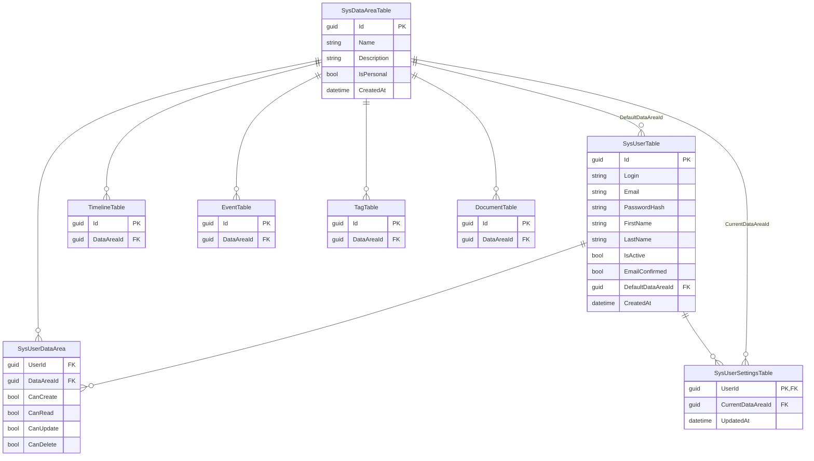

## План: Многопользовательский режим и авторизация

### 1. База данных и миграции
- [ ] Добавить таблицу `SysDataAreaTable` (`Id`, `Name`, `Description`, `IsPersonal`, `CreatedAt`)
- [ ] Добавить таблицу `SysUserTable` (`Id`, `Login`, `Email`, `PasswordHash`, `FirstName`, `LastName`, `IsActive`, `EmailConfirmed`, `DefaultDataAreaId` FK → `SysDataAreaTable.Id`, `CreatedAt`)
- [ ] Добавить таблицу `SysUserDataArea` (`UserId`, `DataAreaId`, `CanCreate`, `CanRead`, `CanUpdate`, `CanDelete`)
- [ ] Добавить таблицу `SysUserSettingsTable` (`UserId`, `CurrentDataAreaId` FK → `SysDataAreaTable.Id`, `UpdatedAt`)
- [ ] Добавить `DataAreaId` в головные таблицы: `TimelineTable`, `EventTable`, `TagTable`, `DocumentTable`
- [ ] Добавить `DataAreaId` в связующие таблицы: `EventTimelineLink`, `TagEventLink`, `DocumentEventLink`
- [ ] Миграция: создать DataArea «Default», привязать существующие записи к ней
- [ ] Seed: создать пользователя `admin`/`admin`, назначить полные права на «Default», создать персональную DataArea для admin

### 2. Бэкенд — аутентификация
- [ ] Установить `bcrypt` для хеширования паролей
- [ ] Реализовать выдачу JWT без срока жизни
- [ ] Создать middleware `authenticate`: извлечение `userId` из `Authorization: Bearer <token>`
- [ ] Endpoints:
  - `POST /auth/register` — создание пользователя + создание персональной DataArea + полные CRUD-права на неё в `SysUserDataArea` + запись её `Id` в `SysUserTable.DefaultDataAreaId` + токен подтверждения email
  - `POST /auth/login` — проверка пароля, возврат JWT + `currentDataAreaId` (из `SysUserSettingsTable` или `DefaultDataAreaId`, если настройки нет)
  - `POST /auth/confirm-email` — активация `EmailConfirmed`
- [ ] Данные профиля текущего пользователя: `GET /auth/me`
- [ ] Endpoints настроек:
  - `GET /auth/settings` — получение `CurrentDataAreaId` и списка доступных для Create областей
  - `PUT /auth/settings` — сохранение `CurrentDataAreaId` в `SysUserSettingsTable`

### 3. Бэкенд — авторизация и фильтрация
- [ ] Middleware/вспомогательная функция `requirePermission(dataAreaId, action)` — проверка CRUD-права пользователя
- [ ] Функция `getAllowedDataAreaIds(userId, action?)` — список доступных областей
- [ ] При READ-запросах: фильтрация по `getAllowedDataAreaIds` + отсечение линков, ведущих в недоступные области
- [ ] При CREATE: `DataAreaId` = текущая область из настроек пользователя (`CurrentDataAreaId`), проверка права Create на неё. По умолчанию — `DefaultDataAreaId` (персональная область)
- [ ] При UPDATE/DELETE: проверка права на исходную `DataAreaId` записи
- [ ] Защита всех существующих routes (`timelines`, `events`, `tags`, `documents`, `settings`)

### 4. Бэкенд — API для прав и администрирования
- [ ] `GET /users` — список пользователей (admin only)
- [ ] `PUT /users/:id` — редактирование пользователя (admin only)
- [ ] `GET /data-areas` — список областей (admin видит все, пользователь — только свои доступные)
- [ ] `GET /data-areas/:id/users` — пользователи с правами на область (admin)
- [ ] `POST /user-data-area` — назначение/изменение прав (admin)
- [ ] `DELETE /user-data-area` — отзыв прав (admin)

### 5. Фронтенд — аутентификация
- [ ] Страница `/login` — форма логина, сохранение JWT + `currentDataAreaId` в `localStorage`
- [ ] Страница `/register` — валидация: имя, фамилия, email (формат), пароль (мин. сложность), подтверждение пароля
- [ ] Страница `/confirm-email?token=...` — активация аккаунта
- [ ] Axios-интерсептор: добавление `Authorization` header
- [ ] React Router guard: редирект на `/login` для неавторизованных
- [ ] При старте приложения загружать настройки через `GET /auth/settings`, сохранять в AuthContext
- [ ] После логина инициализировать `currentDataAreaId` в AuthContext из ответа `/auth/login`

### 6. Фронтенд — разграничение прав в UI
- [ ] AuthContext: хранит `user`, `permissions` (матрицу прав по DataArea), `currentDataAreaId`, загружает при старте
- [ ] Хук `useCan(dataAreaId, action)` — проверка права на конкретную область
- [ ] **Переключатель текущей области данных** (Dropdown в шапке приложения):
  - Отображает название текущей области
  - Список областей, доступных для выбора: только те, где у пользователя есть право Create
  - При смене — вызов `PUT /auth/settings`, обновление `currentDataAreaId` в AuthContext
  - Если `currentDataAreaId` ещё не задан (первый вход), устанавливается `DefaultDataAreaId`
- [ ] **Per-item UI**:
  - Список таймлайнов: для каждого таймлайна проверка прав на его `DataAreaId`
  - Read-only таймлайны: кнопки Edit/Delete скрыты/заблокированы
  - Собственные таймлайны: все контролы активны
- [ ] **Клиентская валидация** перед отправкой запросов: если `useCan` = false, кнопка disabled + запрос не уходит
- [ ] **Создание объектов**: форма создания таймлайна/события не содержит выбора DataArea — `DataAreaId` неявно берётся из `currentDataAreaId`
- [ ] Отображение всех доступных таймлайнов/событий/тегов в едином списке (с переключателем области в шапке)

### 7. Административная панель
- [ ] Страница `/admin`, доступ только для `admin`
- [ ] Вкладка «Пользователи»: таблица с колонками + связанные DataArea с возможностью редактирования прав (CRUD-чекбоксы)
- [ ] Вкладка «Области данных»: таблица областей + список пользователей с правами на каждую область, редактирование принадлежности
- [ ] CRUD пользователей из админ-панели

### 8. Тестирование и валидация
- [ ] Тест: пользователь с правом Read на область A видит данные A, но не может редактировать
- [ ] Тест: попытка редактирования через API без права Update возвращает 403
- [ ] Тест: создание записи падает в текущую DataArea пользователя (`CurrentDataAreaId`)
- [ ] Тест: линки на данные из недоступных областей не отображаются в UI
- [ ] Тест: admin видит всех пользователей и все области
- [ ] Проверка TypeScript: `npx tsc --noEmit -p apps/web/tsconfig.json`
