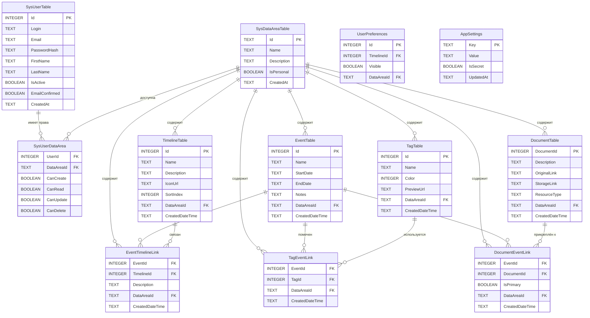

# To-do list
* [-] Ввести многопользовательский режим
* [-] Опубликовать проект в интернете
* [-] Ввести систему авторизации
* [-] Ввести разграничение доступа (админ, пользователь)
* [-] Экспорт и импорт данных в Excel
* [+] Прикрепление и хранение иконок для таймлайна (на Я.Диске)
* [+] Поиск по тэгам
* [+] Добавление картинок к событиям
* [+] Раскраска разными цветами событий
* [+] Всплывающие панельки при наведении на события
* [+] Добавление иконок к тэгам для отображения на таймлайнах
* [+] Сохранение пользовательских настроек для повторного открытия
* [на развитие]Ввести аналог адресной книги чтобы прикреплять к событиям персонажей, а также давать возможсно указывать их выборои из списка в правителях. Вести как отдельный справочник
* [на развитие] Реализовать десктопную версию с кэшированием данных
* [на развитие] Создать приложение для телефона (Antdroid)

---

## План: Многопользовательский режим и авторизация

### 1. База данных и миграции
- [ ] Добавить таблицу `SysDataAreaTable` (`Id`, `Name`, `Description`, `IsPersonal`, `CreatedAt`)
- [ ] Добавить таблицу `SysUserTable` (`Id`, `Login`, `Email`, `PasswordHash`, `FirstName`, `LastName`, `IsActive`, `EmailConfirmed`, `CreatedAt`)
- [ ] Добавить таблицу `SysUserDataArea` (`UserId`, `DataAreaId`, `CanCreate`, `CanRead`, `CanUpdate`, `CanDelete`)
- [ ] Добавить `DataAreaId` в головные таблицы: `TimelineTable`, `EventTable`, `TagTable`, `DocumentTable`
- [ ] Добавить `DataAreaId` в связующие таблицы: `EventTimelineLink`, `TagEventLink`, `DocumentEventLink`
- [ ] Миграция: создать DataArea «Default», привязать существующие записи к ней
- [ ] Seed: создать пользователя `admin`/`admin`, назначить полные права на «Default», создать персональную DataArea для admin

### 2. Бэкенд — аутентификация
- [ ] Установить `bcrypt` для хеширования паролей
- [ ] Реализовать выдачу JWT без срока жизни
- [ ] Создать middleware `authenticate`: извлечение `userId` из `Authorization: Bearer <token>`
- [ ] Endpoints:
  - `POST /auth/register` — создание пользователя + его персональной DataArea + токен подтверждения email
  - `POST /auth/login` — проверка пароля, возврат JWT
  - `POST /auth/confirm-email` — активация `EmailConfirmed`
- [ ] Данные профиля текущего пользователя: `GET /auth/me`

### 3. Бэкенд — авторизация и фильтрация
- [ ] Middleware/вспомогательная функция `requirePermission(dataAreaId, action)` — проверка CRUD-права пользователя
- [ ] Функция `getAllowedDataAreaIds(userId, action?)` — список доступных областей
- [ ] При READ-запросах: фильтрация по `getAllowedDataAreaIds` + отсечение линков, ведущих в недоступные области
- [ ] При CREATE: `DataAreaId` = персональная область пользователя, проверка права Create
- [ ] При UPDATE/DELETE: проверка права на исходную `DataAreaId` записи
- [ ] Защита всех существующих routes (`timelines`, `events`, `tags`, `documents`, `settings`)

### 4. Бэкенд — API для прав и администрирования
- [ ] `GET /users` — список пользователей (admin only)
- [ ] `PUT /users/:id` — редактирование пользователя (admin only)
- [ ] `GET /data-areas` — список областей (admin видит все, пользователь — только свои доступные)
- [ ] `GET /data-areas/:id/users` — пользователи с правами на область (admin)
- [ ] `POST /user-data-area` — назначение/изменение прав (admin)
- [ ] `DELETE /user-data-area` — отзыв прав (admin)

### 5. Фронтенд — аутентификация
- [ ] Страница `/login` — форма логина, сохранение JWT в `localStorage`
- [ ] Страница `/register` — валидация: имя, фамилия, email (формат), пароль (мин. сложность), подтверждение пароля
- [ ] Страница `/confirm-email?token=...` — активация аккаунта
- [ ] Axios-интерсептор: добавление `Authorization` header
- [ ] React Router guard: редирект на `/login` для неавторизованных

### 6. Фронтенд — разграничение прав в UI
- [ ] AuthContext: хранит `user`, `permissions` (матрицу прав по DataArea), загружает при старте
- [ ] Хук `useCan(dataAreaId, action)` — проверка права на конкретную область
- [ ] **Per-item UI**:
  - Список таймлайнов: для каждого таймлайна проверка прав на его `DataAreaId`
  - Read-only таймлайны: кнопки Edit/Delete скрыты/заблокированы
  - Собственные таймлайны: все контролы активны
- [ ] **Клиентская валидация** перед отправкой запросов: если `useCan` = false, кнопка disabled + запрос не уходит
- [ ] Отображение всех доступных таймлайнов/событий/тегов в едином списке (без переключателя области)

### 7. Административная панель
- [ ] Страница `/admin`, доступ только для `admin`
- [ ] Вкладка «Пользователи»: таблица с колонками + связанные DataArea с возможностью редактирования прав (CRUD-чекбоксы)
- [ ] Вкладка «Области данных»: таблица областей + список пользователей с правами на каждую область, редактирование принадлежности
- [ ] CRUD пользователей из админ-панели

### 8. Тестирование и валидация
- [ ] Тест: пользователь с правом Read на область A видит данные A, но не может редактировать
- [ ] Тест: попытка редактирования через API без права Update возвращает 403
- [ ] Тест: создание записи всегда падает в персональную DataArea
- [ ] Тест: линки на данные из недоступных областей не отображаются в UI
- [ ] Тест: admin видит всех пользователей и все области
- [ ] Проверка TypeScript: `npx tsc --noEmit -p apps/web/tsconfig.json`

---

## Целевая структура базы данных (ER-диаграмма)

**Ключевые изменения относительно текущей схемы:**

| Таблица | Изменение |
|---|---|
| `SysDataAreaTable` | **Новая** — справочник областей данных |
| `SysUserTable` | **Новая** — пользователи с хешем пароля |
| `SysUserDataArea` | **Новая** — матрица прав CRUD (User × DataArea) |
| `TimelineTable` | `+ DataAreaId` |
| `EventTable` | `+ DataAreaId` |
| `TagTable` | `+ DataAreaId` |
| `DocumentTable` | `+ DataAreaId` |
| `EventTimelineLink` | `+ DataAreaId` (персональная область создателя связи) |
| `TagEventLink` | `+ DataAreaId` (персональная область создателя связи) |
| `DocumentEventLink` | `+ DataAreaId` (персональная область создателя связи) |
| `UserPreferences` | `+ DataAreaId` |

**Примечание:** связи `EventTimelineLink`, `TagEventLink`, `DocumentEventLink` создаются в **персональной области** пользователя, который их создаёт. Таким образом, если у него заберут права на чтение целевой области (например, чужого таймлайна), его собственные связи всё равно останутся в его DataArea, но при отображении UI будет фильтровать — не показывать связи на недоступные данные.